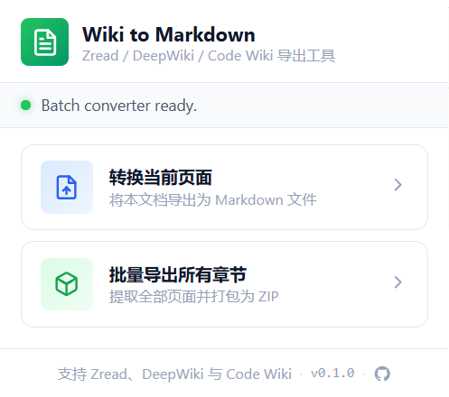
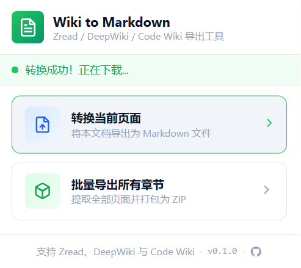
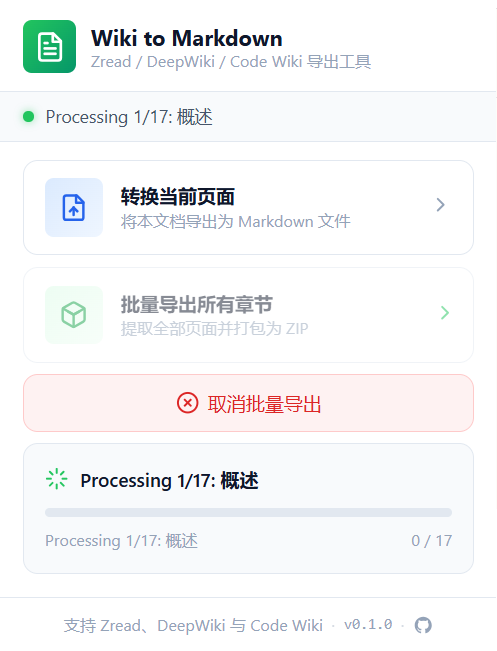

# wiki2md-extension

[English](README_EN.md) | [中文](README.md)

将 Zread、DeepWiki、Google Code Wiki 平台的 wiki 文档解析并保存为 Markdown 文件的浏览器插件。

## ✨ 项目亮点

- 导出当前页面为 `.md`
- 批量导出检测到的章节为 `.zip`
- 在 YAML frontmatter 中保留来源元数据
- 转换常见富文本内容
- 支持 Zread、DeepWiki 和 Google Code Wiki

## 🚀 快速开始

### 🛠️ 安装方式

1. 打开浏览器扩展管理页面。
2. 开启开发者模式。
3. 点击“加载已解压的扩展程序”。
4. 选择 `wiki2md-extension` 文件夹。

### 🎯 使用方式

1. 打开 Zread、DeepWiki 或 Google Code Wiki 页面。
2. 点击扩展图标，打开弹窗。
3. 选择一个操作：
   - `转换当前页面`：导出当前页面为 Markdown
   - `批量导出所有章节`：批量导出检测到的章节并打包为 ZIP
4. 在浏览器下载对话框出现后选择保存位置。

## 🌐 支持站点

- Zread
- DeepWiki
- Google Code Wiki

## 🖼️ 截图

### 🧩 弹窗界面

<p align="center">
  
</p>


### 📝 单页导出结果

<p align="center">
  
</p>

### 📦 批量导出流程

<p align="center">
  
</p>

## 📌 功能说明

- 导出当前页面为 `.md`
- 批量导出检测到的章节为 `.zip`
- 显示进度并支持取消
- 保留 `title`、`source`、`owner`、`repo` 和 `url`
- 转换标题、列表、链接、图片、表格、代码块和引用
- 处理 Code Wiki 的代码片段、图表和表格

## 📄 导出结果

单页导出会生成一个 Markdown 文件。

批量导出会生成一个 ZIP 压缩包，包含：

- 每页一个 Markdown 文件
- 一个自动生成的 `README.md` 索引文件

生成的 Markdown 会包含类似下面的 frontmatter：

```yaml
---
title: "Page Title"
source: zread.ai
owner: example-owner
repo: example-repo
url: https://example.com/page
---
```

## 🔐 权限说明

扩展使用以下权限：

- `activeTab`
- `downloads`
- `storage`
- `tabs`
- `webNavigation`

站点访问权限仅限于：

- `zread.ai`
- `deepwiki.com`
- `codewiki.google`

## ⚠️ 当前限制

- 仅支持指定站点
- 解析依赖站点 DOM 结构，改版后可能失效
- 批量导出依赖可检测的章节链接

## 🙏 致谢

- 感谢 Zread、DeepWiki 和 Google Code Wiki 作为支持的文档来源。
- 灵感参考：[deepwiki-md-chrome-extension](https://github.com/zxmfke/deepwiki-md-chrome-extension)
